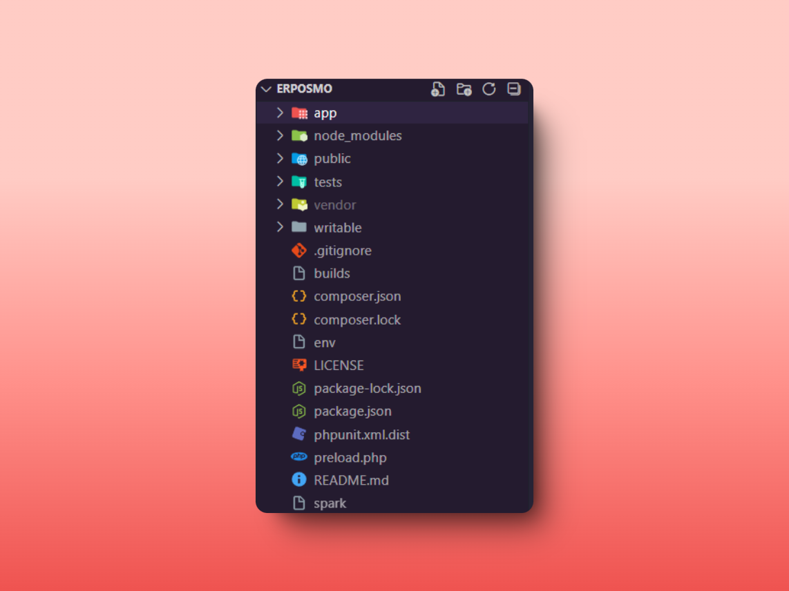

# Instalación

<div data-full-width="true"><figure><figcaption></figcaption></figure></div>

Una excelente documentación comienza con una estructura bien organizada del proyecto. En la imagen se muestra cómo está estructurado, lo que te permitirá comprender su organización de manera clara y sencilla.


¿Deseas saber mas información del proyecto? Puedes acercarte con el equipo de Desarrollo para resolver tus dudas.


### Import

Para clonar el proyecto dirígete al siguiente enlace ahí encontrarás el [<mark style="color:orange;">repositorio</mark>](https://github.com/Dzulmidnight/ERPOSMO). Recuerda que para el funcionamiento correcto del proyecto debes tener instalado:

* **Web Server**: Apache (recommended).
* **PHP**
* **Node.js**
* **Composer**

**Si cuentas con las herramientas antes mencionadas, entonces continua con los siguientes pasos:**

1. **Instalacion de dependencias**

```markdown
composer install
```

```
npm install
```

2. Configura la url Base y la url API

Realiza la configuración de URLs para el funcionamiento correcto del proyecto, esto te ayudará a verificar que te encuentres en las URLs indicadas.
