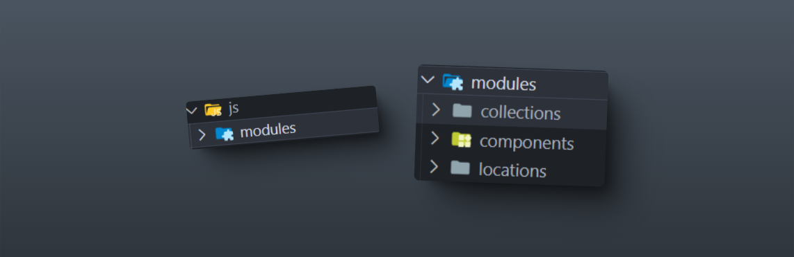

# Modulos

En JavaScript, un módulo es un archivo que contiene funciones, clases o bibliotecas para un objetivo específico. Los módulos permiten organizar el código en partes reutilizables, lo que facilita su mantenimiento y mejora la legibilidad.

<figure><figcaption></figcaption></figure>

Ten en cuenta que, según el concepto de un módulo, trabajarás con ellos a lo largo del desarrollo del proyecto, ya sea implementando nuevos módulos o añadiendo funcionalidades. Esto te permitirá estructurar y reutilizar el código de manera más eficiente y ordenada.

```javascript
/* ../modules/file.js */

// Autoinvocación para encapsular variables y evitar conflictos con otros módulos
(function () {
    "use strict"; // Habilita el modo estricto para mayor seguridad y mejores prácticas

    // Inicializa la función principal del módulo
    function init() {
        console.log("Módulo cargado correctamente");
        // Llama a otras funciones si es necesario
    }

    // Define las funciones de acuerdo con la lógica del módulo
    function exampleFunction() {
        console.log("Ejemplo de función dentro del módulo");
    }

    // Ejecuta la inicialización
    init();
})();

```


Si cuentas con mas módulos, puedes crear nuevos e importarlos al módulo que tu requieras.\
Toma en cuenta que debes llamar correctamente el modulo en la vista que lo requieras y recuerda configurar el script tipo "**module**".

